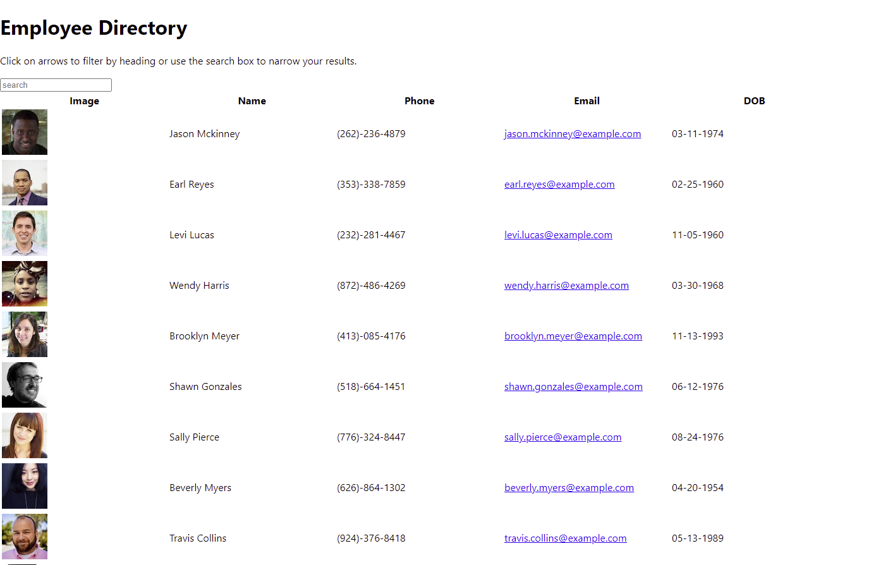

# employeeDirectory

## Image

## Description:

It's sortable employee directory.  

## Table of Contents

[Description](#Description) 
[Function](#Function) 
[Inspiration](#Inspiration) 
[Installation](#Installation) 
[Usage](#Usage) 
[Contributing](#Contributing) 
[Tests](#Tests) 
[Questions](#Questions) 

## Function:

It compiles a list of employees and allows you to order them alphabetically and filter them with a search bar.  

## Inspiration:

To learn more about working with larg amounts of data. 

## Installation:

npm i  

## Usage:

It's good for sorting through an employee directory.  

## Contributing:

It's open to branches.

## Tests:

N.A.

## Questions:

[github.com/AlbertTundy](http://github.com/AlbertTundy) 

### email me at:

https://alberttundy.github.io/employeeDirectory/
